# Manual de Usuario - Sistema de Control de Asistencia Escolar

## Tabla de Contenidos

1. [Introduccion](#1-introduccion)
2. [Objetivos del Sistema](#2-objetivos-del-sistema)
3. [Acceso al Sistema](#3-acceso-al-sistema)
4. [Portal de Direccion e Inspectoria](#4-portal-de-direccion-e-inspectoria)
5. [Portal de Apoderados](#5-portal-de-apoderados)
6. [Aplicacion de Profesores (PWA)](#6-aplicacion-de-profesores-pwa)
7. [Kiosko de Registro](#7-kiosko-de-registro)
8. [Panel de Super Administrador](#8-panel-de-super-administrador)
9. [Notificaciones y Comunicaciones](#9-notificaciones-y-comunicaciones)
10. [Seguridad del Sistema](#10-seguridad-del-sistema)
11. [Preguntas Frecuentes](#11-preguntas-frecuentes)
12. [Soporte Tecnico](#12-soporte-tecnico)

---

## 1. Introduccion

### 1.1 Bienvenida

Bienvenido al Sistema de Control de Asistencia Escolar, una plataforma integral disenada para modernizar y automatizar el registro de ingreso y salida de estudiantes en establecimientos educacionales.

Este sistema permite a colegios y escuelas llevar un control preciso de la asistencia de sus alumnos, notificando automaticamente a los apoderados cuando sus hijos ingresan o salen del establecimiento.

### 1.2 Motivacion

La seguridad de los estudiantes es una prioridad fundamental para cualquier establecimiento educacional. Este sistema nace de la necesidad de:

- **Tranquilidad para los padres**: Los apoderados reciben notificaciones instantaneas via WhatsApp cuando sus hijos llegan o salen del colegio.
- **Control administrativo eficiente**: La direccion y la inspectoria pueden monitorear en tiempo real la asistencia de todo el alumnado.
- **Reduccion de atrasos**: El sistema identifica patrones de atrasos y permite tomar medidas preventivas.
- **Registro fotografico opcional**: Para mayor seguridad, se puede capturar una foto al momento del registro (con consentimiento del apoderado).
- **Autenticacion biometrica**: Los estudiantes pueden registrarse usando su huella digital, eliminando la necesidad de tarjetas que pueden perderse.

### 1.3 Componentes del Sistema

El sistema esta compuesto por varios modulos interconectados:

| Componente | Descripcion | Usuarios |
|------------|-------------|----------|
| **Portal Web** | Aplicacion web para gestion administrativa | Director, Inspector |
| **Portal Apoderados** | Consulta de asistencia y preferencias | Apoderados |
| **PWA Profesores** | Aplicacion movil para profesores jefe | Profesores |
| **Kiosko** | Terminal de registro en porteria | Estudiantes |
| **Panel Super Admin** | Administracion de la plataforma | Administrador de plataforma |

---

## 2. Objetivos del Sistema

### 2.1 Objetivo Principal

Proporcionar un sistema confiable y seguro para el registro de asistencia escolar, mejorando la comunicacion entre el colegio y las familias.

### 2.2 Objetivos Especificos

1. **Automatizar el registro de asistencia**: Eliminar registros manuales propensos a errores.
2. **Notificar en tiempo real**: Informar a los apoderados inmediatamente cuando ocurre un evento de ingreso o salida.
3. **Generar reportes precisos**: Facilitar el analisis de datos de asistencia para la toma de decisiones.
4. **Respetar la privacidad**: Permitir a los apoderados controlar que informacion comparten.
5. **Facilitar la gestion de ausencias**: Permitir a los apoderados justificar ausencias de forma digital.

---

## 3. Acceso al Sistema

### 3.1 Pantalla de Inicio

Al acceder al sistema, vera una pantalla de seleccion de perfil que le permite elegir como desea ingresar:

*Figura 3.1: Pantalla de inicio mostrando las opciones de perfil disponibles*

### 3.2 Tipos de Usuarios

El sistema reconoce los siguientes tipos de usuarios:

| Rol | Descripcion | Acceso |
|-----|-------------|--------|
| **Director** | Maximo responsable del establecimiento | Todas las funciones administrativas |
| **Inspector** | Encargado de la disciplina y asistencia | Gestion de asistencia y reportes |
| **Profesor** | Profesor jefe de un curso | PWA con lista de su curso |
| **Apoderado** | Padre, madre o tutor de un estudiante | Portal de consulta y preferencias |
| **Super Admin** | Administrador de la plataforma | Gestion de colegios (tenants) |

### 3.3 Inicio de Sesion

Para iniciar sesion:

1. Seleccione su tipo de perfil en la pantalla de inicio
2. Ingrese su correo electronico registrado
3. Ingrese su contrasena
4. Haga clic en "Iniciar Sesion"

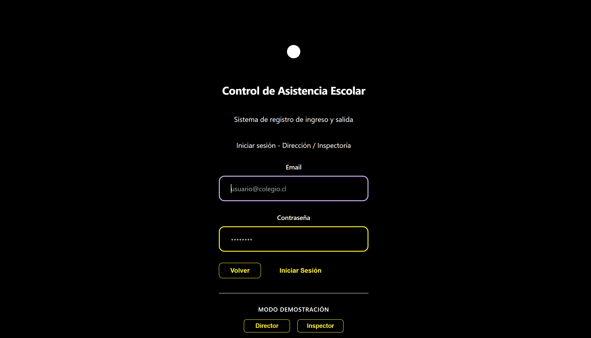

*Figura 3.2: Formulario de inicio de sesion para personal administrativo*

> **Nota de seguridad**: Si olvida su contrasena, contacte al administrador del sistema. No comparta sus credenciales con otras personas.

---

## 4. Portal de Direccion e Inspectoria

El portal administrativo es la herramienta principal para el personal del colegio. Permite monitorear la asistencia en tiempo real, generar reportes, gestionar horarios y mucho mas.

### 4.1 Tablero Principal (Dashboard)

Al ingresar, vera el tablero principal con informacion en vivo:

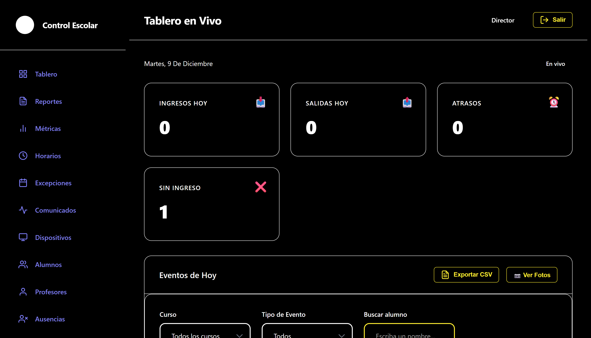

*Figura 4.1: Tablero en vivo mostrando estadisticas del dia*

El tablero muestra:

- **Ingresos Hoy**: Cantidad de estudiantes que han ingresado
- **Salidas Hoy**: Cantidad de estudiantes que han salido
- **Atrasos**: Estudiantes que llegaron despues de la hora establecida
- **Sin Ingreso**: Estudiantes que aun no han registrado su llegada

Ademas, puede ver la lista de eventos del dia con filtros por:
- Curso
- Tipo de evento (Ingreso/Salida)
- Nombre del alumno

### 4.2 Reportes

La seccion de reportes permite generar informes detallados de asistencia:

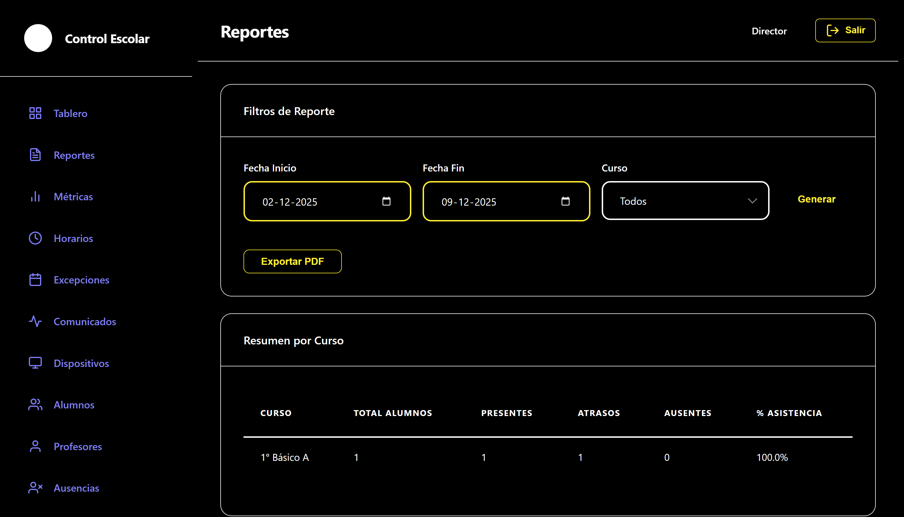

*Figura 4.2: Generador de reportes con filtros y estadisticas*

**Como generar un reporte:**

1. Seleccione el rango de fechas (Fecha Inicio y Fecha Fin)
2. Opcionalmente, filtre por curso especifico
3. Haga clic en "Generar"
4. Revise el resumen por curso con porcentajes de asistencia
5. Use "Exportar PDF" para descargar el reporte

El reporte incluye:
- Total de alumnos por curso
- Cantidad de presentes
- Cantidad de atrasos
- Cantidad de ausentes
- Porcentaje de asistencia

### 4.3 Metricas

La seccion de metricas ofrece visualizaciones avanzadas:

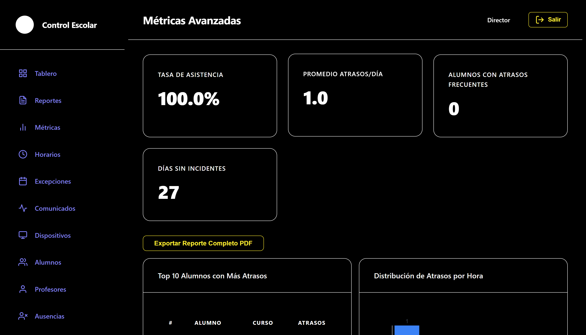

*Figura 4.3: Graficos y metricas de asistencia*

Aqui puede analizar:
- Tendencias semanales y mensuales
- Comparativas entre cursos
- Patrones de atrasos
- Evolucion historica de la asistencia

### 4.4 Horarios

Configure los horarios de entrada y salida para cada nivel o curso:

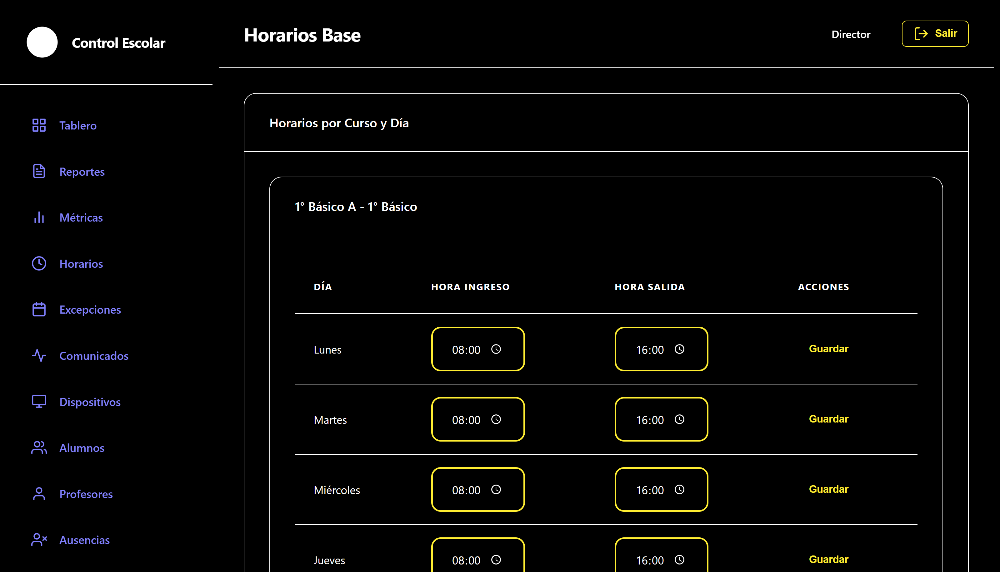

*Figura 4.4: Configuracion de horarios escolares*

Los horarios definen:
- Hora de inicio de clases (considera un alumno "a tiempo")
- Tolerancia para atrasos
- Hora de salida regular
- Diferencias por dia de la semana

### 4.5 Excepciones de Horario

Gestione dias especiales como:
- Reuniones de apoderados
- Actos civicos
- Salidas anticipadas
- Dias sin clases

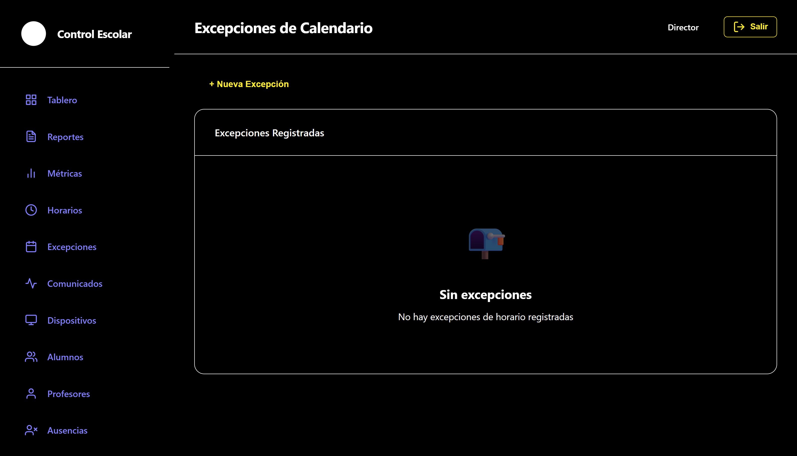

*Figura 4.5: Gestion de excepciones al horario regular*

### 4.6 Comunicados

Envie comunicados masivos a los apoderados via WhatsApp:

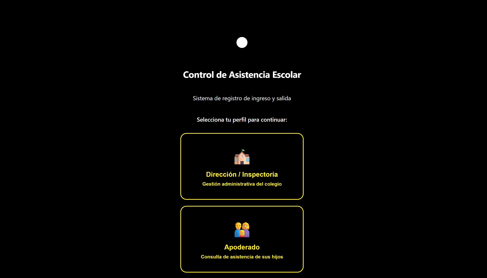

*Figura 4.6: Sistema de comunicados a apoderados*

**Tipos de comunicados:**
- Informativos generales
- Alertas de emergencia
- Recordatorios
- Cambios de horario

### 4.7 Dispositivos

Administre los kioskos y dispositivos de registro:

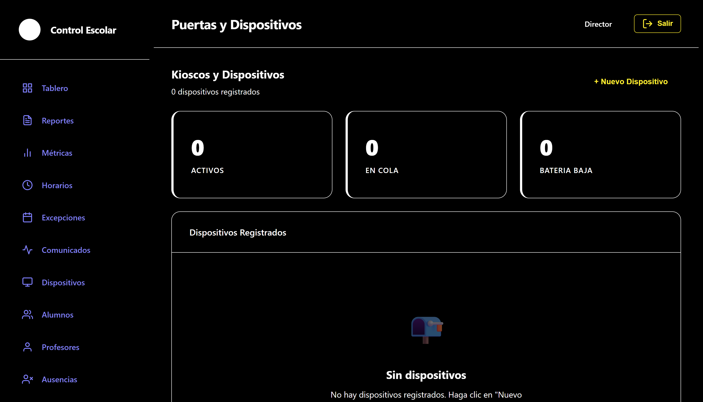

*Figura 4.7: Panel de administracion de dispositivos*

Desde aqui puede:
- Ver el estado de cada kiosko (online/offline)
- Configurar nuevos dispositivos
- Monitorear la actividad

### 4.8 Alumnos

Gestione la informacion de los estudiantes:

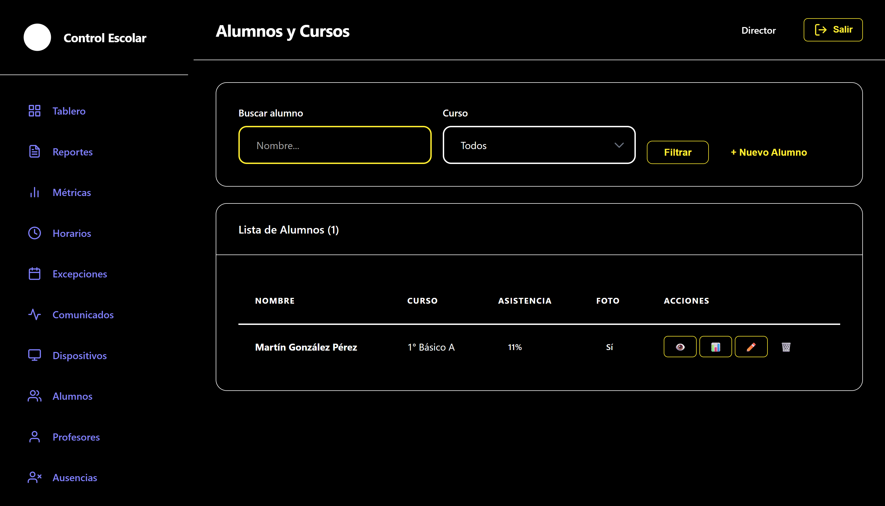

*Figura 4.8: Gestion de alumnos del establecimiento*

Funcionalidades:
- Ver listado completo de alumnos
- Filtrar por curso
- Ver detalles de cada estudiante
- Gestionar tarjetas/tags de acceso

### 4.9 Profesores

Administre el equipo docente:

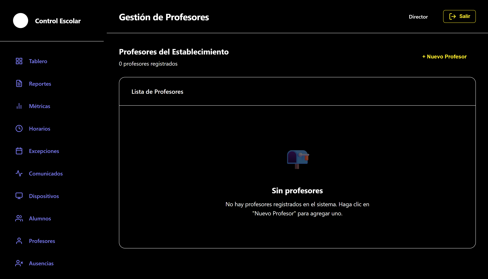

*Figura 4.9: Listado y gestion de profesores*

### 4.10 Ausencias

Gestione las solicitudes de ausencia enviadas por apoderados:

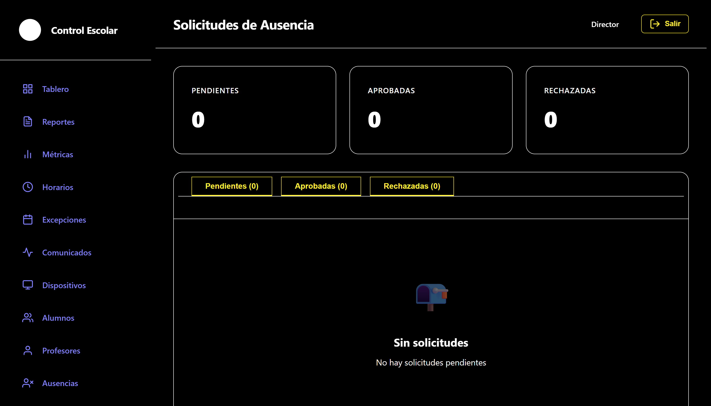

*Figura 4.10: Panel de solicitudes de ausencia*

Puede:
- Ver solicitudes pendientes
- Aprobar o rechazar ausencias
- Ver el historial de ausencias por alumno

### 4.11 Notificaciones

Revise el historial de notificaciones enviadas:

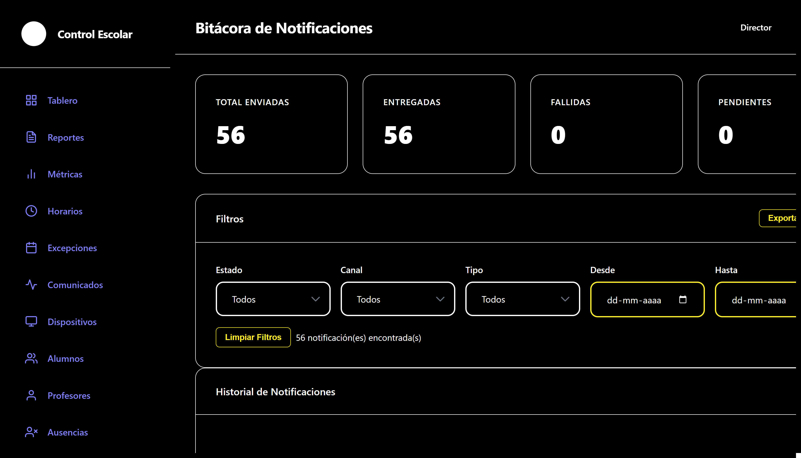

*Figura 4.11: Historial de notificaciones del sistema*

Informacion disponible:
- Fecha y hora de envio
- Tipo de notificacion
- Destinatario
- Estado de entrega

### 4.12 Biometria

Administre las credenciales biometricas de los estudiantes:

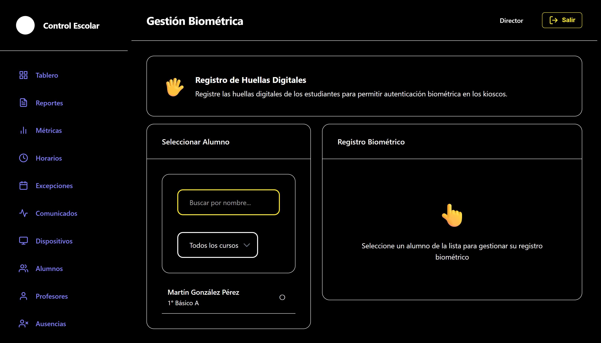

*Figura 4.12: Panel de administracion de huellas digitales*

Desde aqui puede:
- Ver alumnos con biometria registrada
- Eliminar credenciales
- Ver estadisticas de uso

---

## 5. Portal de Apoderados

El portal de apoderados permite a los padres y tutores consultar la asistencia de sus hijos y configurar sus preferencias de notificacion.

### 5.1 Pantalla de Inicio

Al ingresar, vera el estado actual de asistencia de sus hijos:

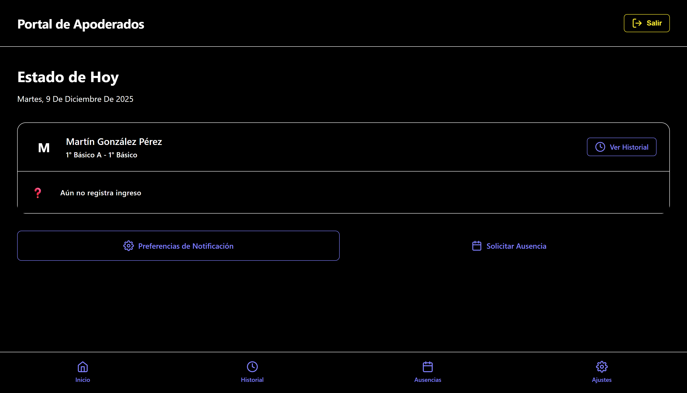

*Figura 5.1: Pantalla principal del portal de apoderados*

La pantalla muestra:
- Estado del dia para cada hijo
- Ultimo evento registrado
- Accesos rapidos a historial y configuracion

### 5.2 Historial de Asistencia

Consulte el historial detallado de asistencia:

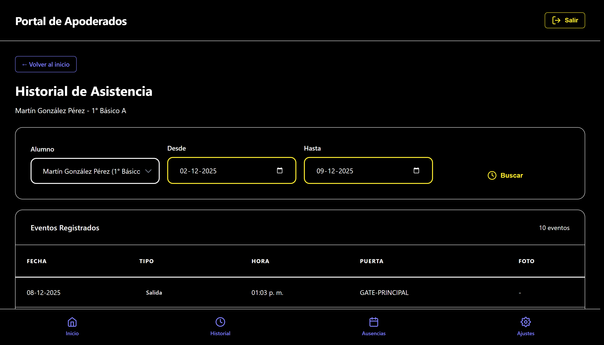

*Figura 5.2: Historial de eventos de ingreso y salida*

Puede ver:
- Fechas y horas de cada evento
- Tipo de evento (ingreso/salida)
- Si hubo atraso
- Foto del evento (si esta habilitado)

### 5.3 Solicitar Ausencia

Notifique al colegio sobre ausencias programadas:

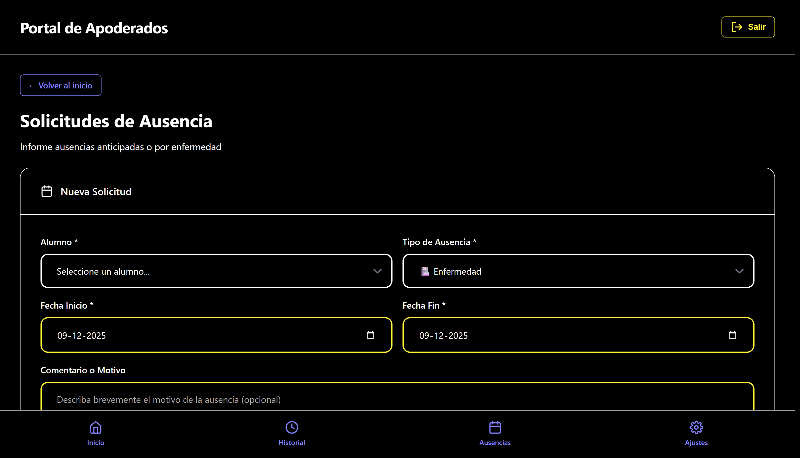

*Figura 5.3: Formulario de solicitud de ausencia*

**Como solicitar una ausencia:**

1. Seleccione el hijo para el que solicita la ausencia
2. Indique la fecha o rango de fechas
3. Seleccione el motivo (enfermedad, viaje, cita medica, otro)
4. Agregue comentarios adicionales si es necesario
5. Envie la solicitud

El colegio revisara la solicitud y podra aprobarla o rechazarla.

### 5.4 Preferencias de Notificacion

Configure como y cuando desea recibir notificaciones:

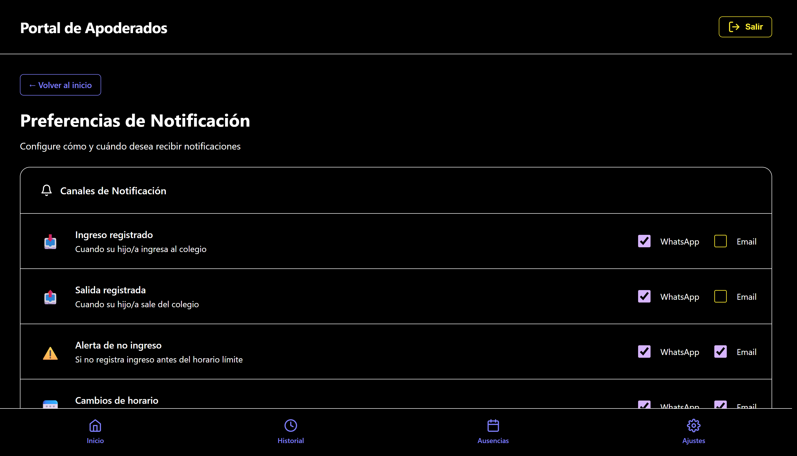

*Figura 5.4: Configuracion de preferencias de notificacion*

**Opciones disponibles:**

| Tipo de Notificacion | WhatsApp | Email |
|---------------------|----------|-------|
| Ingreso registrado | Si/No | Si/No |
| Salida registrada | Si/No | Si/No |
| Alerta de no ingreso | Si/No | Si/No |
| Cambios de horario | Si/No | Si/No |

**Consentimiento de fotos:**

Tambien puede configurar si autoriza que se capture una foto de su hijo al momento del registro. Esta configuracion se aplica de forma individual para cada hijo.

---

## 6. Aplicacion de Profesores (PWA)

La aplicacion para profesores es una Progressive Web App (PWA) optimizada para dispositivos moviles. Permite a los profesores jefe gestionar la asistencia de su curso.

### 6.1 Inicio de Sesion

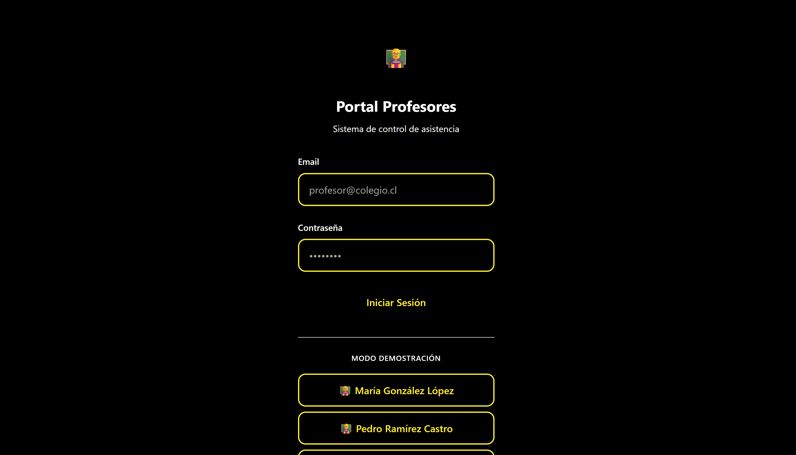

*Figura 6.1: Pantalla de inicio de sesion para profesores*

### 6.2 Mis Cursos

Al ingresar, vera los cursos asignados:

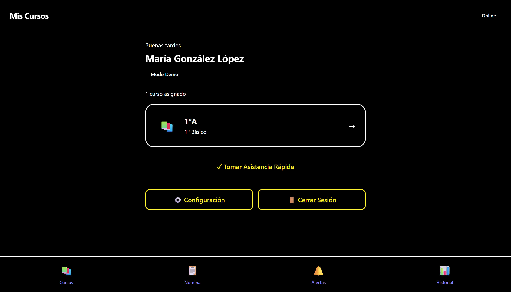

*Figura 6.2: Pantalla principal con cursos asignados*

Funciones disponibles:
- Ver cursos asignados
- Tomar asistencia rapida
- Acceder a configuracion

### 6.3 Nomina del Curso

Vea la lista completa de alumnos de su curso:

*Figura 6.3: Nomina de estudiantes del curso*

### 6.4 Alertas

Reciba notificaciones importantes sobre sus alumnos:

*Figura 6.4: Centro de alertas para el profesor*

Tipos de alertas:
- Alumnos con multiples atrasos
- Alumnos que no han llegado
- Solicitudes de ausencia pendientes

### 6.5 Historial

Consulte el historial de asistencia de su curso:

*Figura 6.5: Historial de asistencia del curso*

---

## 7. Kiosko de Registro

El kiosko es el terminal fisico ubicado en la entrada del establecimiento donde los estudiantes registran su ingreso y salida.

### 7.1 Pantalla de Escaneo

*Figura 7.1: Pantalla de escaneo del kiosko*

### 7.2 Metodos de Registro

Los estudiantes pueden registrarse de tres formas:

#### 7.2.1 Codigo QR
1. El alumno presenta su credencial con codigo QR
2. La camara del kiosko lee el codigo
3. Se registra automaticamente el evento

#### 7.2.2 Tarjeta NFC
1. El alumno acerca su tarjeta NFC al lector
2. El sistema identifica al estudiante
3. Se registra el evento

#### 7.2.3 Huella Digital
1. El alumno presiona "Usar huella digital"
2. Coloca su dedo en el lector biometrico
3. El sistema lo identifica y registra el evento

### 7.3 Politica de Multiples Credenciales

El sistema permite que cada estudiante tenga **multiples metodos de identificacion activos simultaneamente**. Esto significa que:

- Un alumno puede tener QR, NFC y huella digital, todos activos al mismo tiempo
- Enrollar un nuevo metodo **no desactiva** los metodos anteriores
- El estudiante puede usar cualquiera de sus credenciales activas para registrarse

**Ventajas de esta politica:**

| Escenario | Solucion |
|-----------|----------|
| Olvido la tarjeta NFC | Usa el QR en el celular del apoderado |
| El celular no tiene bateria | Usa la tarjeta NFC |
| Perdio ambas credenciales | Usa la huella digital |

**Recomendacion:** Se sugiere enrollar al menos dos metodos por estudiante para garantizar que siempre pueda registrar su asistencia.

> **Nota para administradores:** Si necesita revocar una credencial especifica (por ejemplo, por perdida de tarjeta), puede hacerlo individualmente desde el panel de administracion sin afectar los otros metodos del estudiante.

### 7.4 Confirmacion de Registro

Despues de un registro exitoso, el kiosko muestra:
- Nombre del estudiante
- Tipo de evento (Ingreso/Salida)
- Hora del registro
- Opcionalmente captura una foto (si el apoderado lo autorizo)

---

## 8. Panel de Super Administrador

El panel de super administrador es exclusivo para la administracion de la plataforma a nivel global. Permite gestionar multiples colegios (tenants).

### 8.1 Acceso

El super administrador accede desde una URL especial:

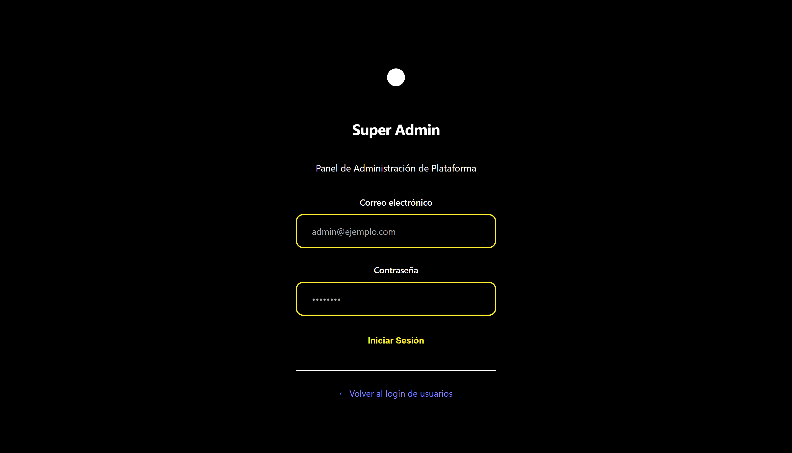

*Figura 8.1: Pantalla de acceso para super administradores*

### 8.2 Panel de Control

El dashboard muestra estadisticas globales de la plataforma:

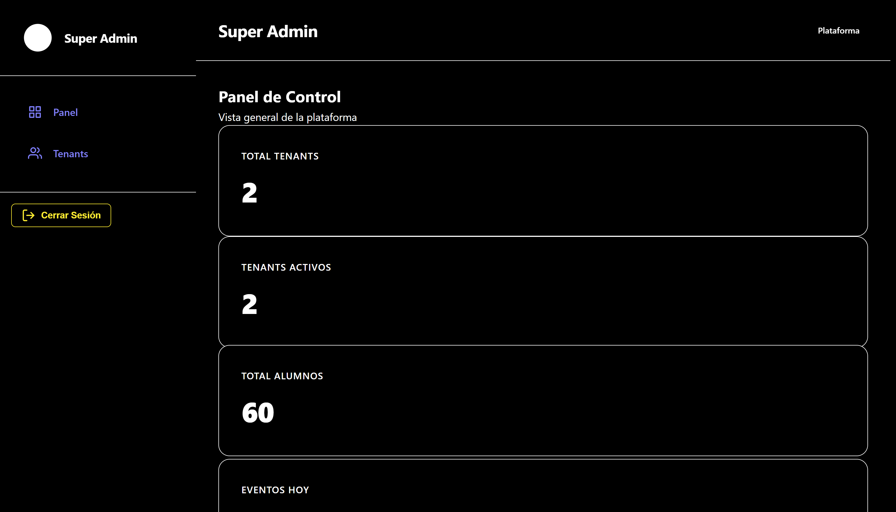

*Figura 8.2: Panel de control del super administrador*

Metricas disponibles:
- Total de tenants (colegios)
- Tenants activos
- Total de alumnos en la plataforma
- Eventos del dia

### 8.3 Gestion de Tenants

Administre los colegios registrados en la plataforma:

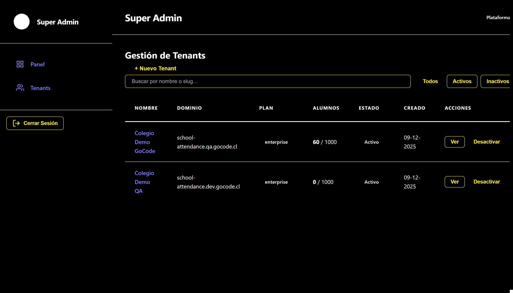

*Figura 8.3: Gestion de tenants (colegios)*

Funciones:
- Crear nuevos tenants
- Activar/desactivar colegios
- Configurar planes y limites
- Impersonar usuarios para soporte

---

## 9. Notificaciones y Comunicaciones

### 9.1 Notificaciones por WhatsApp

El sistema envia notificaciones automaticas via WhatsApp para:

| Evento | Mensaje de Ejemplo |
|--------|-------------------|
| **Ingreso OK** | "Ingreso registrado: Maria ingreso al colegio el 09/12/2025 a las 08:15." |
| **Salida OK** | "Salida registrada: Maria salio del colegio el 09/12/2025 a las 15:30." |
| **Alerta No Ingreso** | "Alerta: Maria no ha registrado ingreso al colegio hoy 09/12/2025." |
| **Cambio Horario** | "Aviso: Se ha modificado el horario de Maria para el 10/12/2025." |

### 9.2 Notificaciones por Email

Alternativamente, las notificaciones pueden enviarse por correo electronico para apoderados que lo prefieran.

### 9.3 Configuracion de Preferencias

Cada apoderado puede configurar:
- Que tipos de notificaciones desea recibir
- Por que canal (WhatsApp, Email, o ambos)
- Para cada hijo individualmente

---

## 10. Seguridad del Sistema

### 10.1 Autenticacion

El sistema utiliza multiples capas de seguridad:

- **Contrasenas seguras**: Se requieren contrasenas de minimo 8 caracteres
- **Tokens JWT**: Las sesiones se gestionan con tokens seguros
- **Sesiones con expiracion**: Las sesiones expiran automaticamente por inactividad

### 10.2 Autorizacion por Roles

Cada usuario solo puede acceder a las funciones correspondientes a su rol:

| Rol | Permisos |
|-----|----------|
| Director | Acceso completo a funciones administrativas |
| Inspector | Gestion de asistencia, reportes, comunicados |
| Profesor | Solo su curso asignado |
| Apoderado | Solo sus hijos |

### 10.3 Privacidad de Datos

- Las fotos solo se capturan si el apoderado da su consentimiento
- Los datos personales estan protegidos segun normativas vigentes
- El acceso a informacion de estudiantes esta restringido por rol

### 10.4 Aislamiento Multi-Tenant

Cada colegio (tenant) tiene sus datos completamente aislados:
- Base de datos separada logicamente
- No es posible acceder a datos de otros colegios
- Autenticacion independiente por tenant

---

## 11. Preguntas Frecuentes

### General

**P: Como puedo recuperar mi contrasena?**
R: Contacte al administrador del sistema de su colegio. Por seguridad, las contrasenas no se envian por email.

**P: El sistema funciona en mi celular?**
R: Si, el sistema esta disenado para funcionar en cualquier navegador moderno, tanto en computadoras como en dispositivos moviles.

### Apoderados

**P: No recibo notificaciones por WhatsApp, que hago?**
R: Verifique que:
1. Su numero de telefono este correctamente registrado
2. Tenga las notificaciones habilitadas en Preferencias
3. WhatsApp este actualizado en su telefono

**P: Puedo desactivar las notificaciones temporalmente?**
R: Si, desde la seccion de Preferencias puede desactivar cualquier tipo de notificacion.

**P: Mi hijo perdio su tarjeta de acceso, que hago?**
R: Si su hijo tiene otros metodos de identificacion activos (QR o huella digital), puede seguir usandolos normalmente. Contacte a la inspectoria para:
1. Revocar la tarjeta perdida (evita uso indebido)
2. Solicitar una nueva tarjeta NFC
Los otros metodos de registro permaneceran activos durante este proceso.

### Personal del Colegio

**P: Un alumno aparece sin ingreso pero si vino, que hago?**
R: Puede registrar manualmente el evento desde el tablero, indicando la hora real de llegada.

**P: Como exporto los reportes a Excel?**
R: Los reportes se exportan en formato PDF. Para Excel, copie los datos de la tabla o contacte soporte tecnico.

---

## 12. Soporte Tecnico

### Contacto

Para soporte tecnico, contacte a:

- **Email**: soporte@gocode.cl
- **Telefono**: +56 9 XXXX XXXX
- **Horario**: Lunes a Viernes, 9:00 a 18:00 hrs

### Reportar Problemas

Al reportar un problema, incluya:
1. Descripcion detallada del error
2. Pasos para reproducirlo
3. Captura de pantalla si es posible
4. Navegador y dispositivo utilizado

### Actualizaciones

El sistema se actualiza periodicamente con mejoras y nuevas funcionalidades. Las actualizaciones se realizan de forma transparente sin afectar la operacion normal.

---

## Glosario

| Termino | Definicion |
|---------|------------|
| **Tenant** | Cada colegio registrado en la plataforma |
| **PWA** | Progressive Web App - Aplicacion web que funciona como app nativa |
| **NFC** | Near Field Communication - Tecnologia de comunicacion inalambrica de corto alcance |
| **QR** | Quick Response - Codigo de respuesta rapida |
| **JWT** | JSON Web Token - Formato estandar para tokens de autenticacion |
| **Kiosko** | Terminal de autoservicio para registro de asistencia |

---

*Manual de Usuario - Sistema de Control de Asistencia Escolar*
*Version 1.0 - Diciembre 2025*
*GoCode - Soluciones Tecnologicas*
